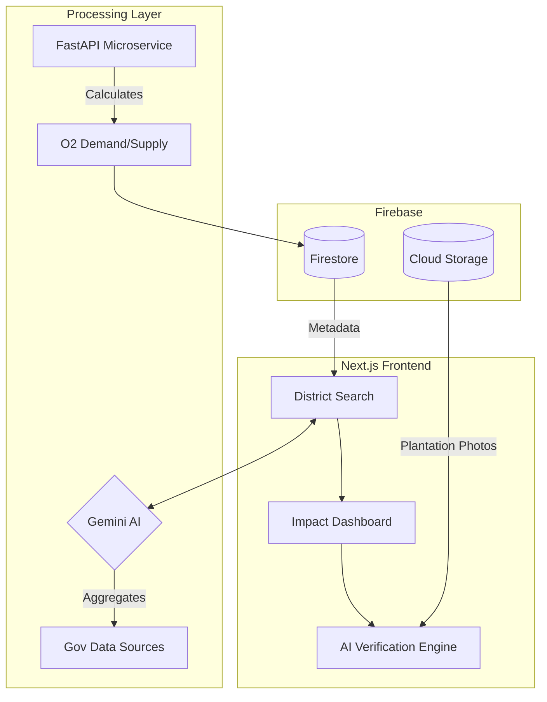

# Vayura

<!-- ALL-CONTRIBUTORS-BADGE:START - Do not remove or modify this section -->
[](#contributors-)
<!-- ALL-CONTRIBUTORS-BADGE:END -->

## Why Vayura?

India lacks district-level visibility into environmental oxygen demand.
Vayura bridges the gap between **data, awareness, and action** by turning
abstract environmental metrics into real-world tree plantation workflows.

**District-Level Oxygen Intelligence for a Greener India**

Vayura is an open-source web application that estimates district-level oxygen demand across India and converts it into actionable tree-plantation and donation workflows. Built with transparency, scientific accuracy, and community contribution at its core.

[](https://opensource.org/licenses/MIT)
[](https://nextjs.org/)
[](https://www.typescriptlang.org/)
[](https://www.python.org/)

---

## 🚀 Features at a Glance

| 🌍 District Intelligence                                            | 🌳 Impact & Plantation                                             | 🤖 AI & Analytics                                                  |
| :------------------------------------------------------------------ | :----------------------------------------------------------------- | :----------------------------------------------------------------- |
| **All-India Coverage:** Data for every district across the nation.  | **Tree Upload System:** Upload photos of your plantations.         | **Gemini AI Aggregation:** Intelligent multi-source data fetching. |
| **O₂ Demand/Supply:** Real-time estimation vs. natural supply.      | **AI Verification:** Machine learning to verify plantation photos. | **Environmental Health Card:** AQI, Soil quality, & Disaster risk. |
| **State Leaderboards:** Rankings for oxygen self-sufficiency.       | **NGO Donation Hub:** Verified links to environmental NGOs.        | **Interactive Charts:** Visual insights via Recharts.              |
| **Deficit Indicators:** Clear visual cues for oxygen-starved zones. | **Personal Dashboard:** Track your planted vs. donated trees.      | **Transparent Logic:** All scientific formulas shown in-app.       |

---

## 🏗️ System Architecture

To help developers understand the "District-Level Oxygen Intelligence" flow, here is how the Next.js App Router, Firebase, and Gemini AI interact:



---

## Tech Stack

### Frontend

- **Next.js 16+** (App Router)
- **React 19** with TypeScript
- **Tailwind CSS** for styling
- **Recharts** for data visualization

### Backend

- **Node.js** (Next.js API Routes)
- **Python FastAPI** microservice for oxygen calculations (optional)
- **Firebase Firestore** for database
- **Firebase Authentication** for user management
- **Firebase Storage** for image uploads
- **Google Gemini AI** for intelligent data aggregation

## Prerequisites

- Node.js 18+ and npm
- Python 3.11+ (optional, for calculation microservice)
- **Firebase Project**: For authentication, database, and storage
- **Google Gemini API Key**: For intelligent data fetching

## Quick Start (Docker)

The fastest way to run Vayura (Frontend + Backend) without manual dependencies.

### 1. Start the Application

```bash
# Create .env from example
cp .env.example .env

# Start with Docker Compose
docker-compose up --build
```

### 2. Access Services

- **Frontend**: [http://localhost:3000](http://localhost:3000)
- **Backend**: [http://localhost:8000/health](http://localhost:8000/health)

For detailed setup instructions, troubleshooting, or manual setup, see [SETUP.md](./SETUP.md).

## Quick Start (local)

### 1. Clone the Repository

```bash
git clone https://github.com/manasdutta04/vayura.git
cd vayura
```

### 2. Install Dependencies

```bash
npm install
```

### 3. Set Up Firebase

1. Create a Firebase project at [Firebase Console](https://console.firebase.google.com/)
2. Enable **Authentication** (Email/Password and Google providers)
3. Create a **Firestore Database** (start in production mode)
4. Create a **Cloud Storage** bucket
5. Download service account key: Project Settings > Service Accounts > Generate New Private Key
6. Save the JSON file as `firebase-service-account.json` in the project root

### 4. Set Up Environment Variables

Create a `.env.local` file in the root directory:

```bash
# Firebase Configuration
NEXT_PUBLIC_FIREBASE_API_KEY=your_api_key
NEXT_PUBLIC_FIREBASE_AUTH_DOMAIN=your_project.firebaseapp.com
NEXT_PUBLIC_FIREBASE_PROJECT_ID=your_project_id
NEXT_PUBLIC_FIREBASE_STORAGE_BUCKET=your_project.appspot.com
NEXT_PUBLIC_FIREBASE_MESSAGING_SENDER_ID=your_sender_id
NEXT_PUBLIC_FIREBASE_APP_ID=your_app_id

# Firebase Admin SDK (Server-side)
FIREBASE_ADMIN_PROJECT_ID=your_project_id
FIREBASE_ADMIN_CLIENT_EMAIL=your_service_account_email
FIREBASE_ADMIN_PRIVATE_KEY=your_private_key

# Google Gemini API
GEMINI_API_KEY=your_gemini_api_key

# OpenWeatherMap (Optional, for AQI fallback)
OPENWEATHERMAP_API_KEY=your_openweathermap_key

# Base URL
NEXT_PUBLIC_BASE_URL=http://localhost:3000
```

### 5. Set Up Firestore

1. Deploy Firestore indexes:
   - Copy the index URL from `firestore.indexes.json` errors
   - Or deploy via Firebase Console

2. Deploy Firestore security rules:
   - Copy rules from `firestore.rules` to Firebase Console > Firestore > Rules

3. Seed initial data:

```bash
npx tsx scripts/seed-districts.ts
npx tsx scripts/seed-forest-cover-data.ts
```

### 6. Start Development Server

```bash
npm run dev
```

Visit [http://localhost:3000](http://localhost:3000) to see the application.

## Development Notes

- Firebase Admin keys must never be committed
- Use `.env.local` only
- Prefer mock data when working on UI
- Python microservice is optional for frontend contributors

---

## 🧪 Oxygen Calculation Methodology

Vayura uses a transparent, scientifically-backed approach. We convert abstract environmental data into precise metrics using the following logic:

### 1. Base Human $O_2$ Demand

The annual oxygen requirement for a district's population:

$$D_{base} = \text{Population} \times 550L/\text{day} \times 365 \text{ days}$$

### 2. Penalty Factors

We adjust demand based on environmental stressors:

- **AQI Factor ($F_{aqi}$):** Increases demand due to respiratory stress.
- **Soil Factor ($F_{soil}$):** Adjusts for natural oxygen source degradation.
- **Disaster Factor ($F_{dis}$):** Accounts for vegetation loss.

### 3. Final Adjusted Demand

$$D_{adj} = D_{base} \times F_{aqi} \times F_{soil} \times F_{dis}$$

### 4. Trees Required to Offset Deficit

To calculate how many trees are needed to reach a balance:

$$T_{req} = \frac{\text{Oxygen Deficit}}{\text{Adjusted Annual Tree Supply}}$$

**All assumptions and data sources are displayed in the UI for full transparency.**

## Data Sources

Vayura uses a multi-tier data fetching approach:

1. **Primary**: Google Gemini AI - Intelligently aggregates data from multiple government sources
2. **Secondary**: OpenWeatherMap API - Real-time AQI data
3. **Fallback**: Built-in government published data and statistical estimates

See [DATA_SOURCES.md](./DATA_SOURCES.md) for complete data source documentation.

---

## 📂 Project Structure

Vayura follows the Next.js 16+ `src/app` directory convention for modularity and scalability:

```text
vayura/
├── src/
│   ├── app/                      # 🚀 NEXT.JS APP ROUTER (Pages & APIs)
│   │   ├── (auth)/               # Auth-related route groups
│   │   ├── api/                  # Serverless Backend Endpoints
│   │   │   ├── districts/        # Oxygen & environmental data fetching
│   │   │   ├── plant/            # AI image verification & uploads
│   │   │   └── leaderboard/      # State-level ranking logic
│   │   ├── dashboard/            # User-specific impact analytics
│   │   ├── districts/            # District-level detail pages
│   │   └── layout.tsx            # Global providers & root UI
│   ├── components/               # 🧱 REUSABLE UI COMPONENTS
│   │   ├── ui/                   # Shadcn/Radix primitive components
│   │   ├── charts/               # Recharts environmental visualizations
│   │   └── maps/                 # Interactive Indian district maps
│   ├── lib/                      # ⚙️ CORE LOGIC & UTILITIES
│   │   ├── firebase/             # Client & Admin SDK configurations
│   │   ├── calculations/         # Scientific O2 demand formulas
│   │   ├── types/                # TypeScript interfaces & enums
│   │   └── utils/                # Formatting & helper functions
│   └── middleware.ts             # Auth & Route protection logic
├── services/                     # 🐍 OPTIONAL MICROSERVICES
│   └── oxygen-calculator/        # Python FastAPI engine (Advanced logic)
├── scripts/                      # 🛠️ AUTOMATION
│   └── seed-data.ts              # Firestore initial seeding scripts
├── public/                       # 🖼️ STATIC ASSETS (Logos, Icons)
├── firestore.rules               # 🔥 Database Security Rules
└── package.json                  # Dependencies & Scripts
```

---

## Contributing

We welcome contributions! This is an open-source project and your help makes it better.

### How to Contribute

1. **Fork the repository** on GitHub
2. **Clone your fork** locally
3. **Create a branch** for your feature (`git checkout -b feature/amazing-feature`)
4. **Make your changes** following our coding standards
5. **Test thoroughly** before committing
6. **Commit** with clear messages (`git commit -m 'Add amazing feature'`)
7. **Push** to your fork (`git push origin feature/amazing-feature`)
8. **Open a Pull Request** on GitHub

See [CONTRIBUTING.md](./CONTRIBUTING.md) for detailed guidelines.

### Areas for Contribution

- **Data Sources**: Add more government data integrations
- **Features**: New functionality and improvements
- **Documentation**: Improve docs and add examples
- **Bug Fixes**: Report and fix issues
- **UI/UX**: Design improvements and accessibility
- **Testing**: Add tests and improve coverage

## License

This project is licensed under the MIT License - see the [LICENSE](./LICENSE) file for details.

Copyright (c) 2026 Manas Dutta

## Disclaimer

**Important**: Vayura provides educational estimates based on available data and scientific models. The oxygen calculations and environmental metrics are:

- **Not medical advice**: Do not use for health decisions
- **Not policy guidance**: Consult experts for governance decisions
- **Subject to data availability**: Accuracy depends on source data quality
- **Estimates only**: Real-world conditions vary

Always verify critical information with official sources and domain experts.

## Acknowledgments

- **WHO**: Human oxygen consumption standards
- **USDA Forest Service**: Tree oxygen production research
- **EPA**: Air Quality Index methodology
- **Government of India**: Census, FSI, NDMA, CPCB data
- **OpenWeatherMap**: Air quality data API
- **Google Gemini**: AI-powered data aggregation
- **The open-source community**: For inspiration and support

## Contact & Support

- **GitHub Repository**: [https://github.com/manasdutta04/vayura](https://github.com/manasdutta04/vayura)
- **Issues**: [GitHub Issues](https://github.com/manasdutta04/vayura/issues)
- **Contributions**: [See CONTRIBUTING.md](./CONTRIBUTING.md)

## Creators

- Developed by [Manas Dutta](https://github.com/manasdutta04)

## Contributors

<!-- ALL-CONTRIBUTORS-LIST:START -->
<!-- prettier-ignore-start -->
<!-- markdownlint-disable -->
<table>
  <tbody>
    <tr>
      <td align="center" valign="top" width="14.28%"><a href="https://amankumar.site"><br /><sub><b>Aman Kumar </b></sub></a><br /><a href="https://github.com/manasdutta04/vayura/commits?author=Amanc77" title="Code">💻</a></td>
      <td align="center" valign="top" width="14.28%"><a href="https://github.com/VITianYash42"><br /><sub><b>Yash Singhal</b></sub></a><br /><a href="https://github.com/manasdutta04/vayura/commits?author=VITianYash42" title="Code">💻</a></td>
      <td align="center" valign="top" width="14.28%"><a href="https://github.com/Diksha78-bot"><br /><sub><b>Diksha Dhanaji Dabhole</b></sub></a><br /><a href="https://github.com/manasdutta04/vayura/commits?author=Diksha78-bot" title="Code">💻</a></td>
      <td align="center" valign="top" width="14.28%"><a href="https://github.com/sarojit049"><br /><sub><b>Saroj Kumar</b></sub></a><br /><a href="https://github.com/manasdutta04/vayura/commits?author=sarojit049" title="Code">💻</a></td>
      <td align="center" valign="top" width="14.28%"><a href="https://github.com/aagmanpal"><br /><sub><b>Aagman Pal</b></sub></a><br /><a href="https://github.com/manasdutta04/vayura/commits?author=aagmanpal" title="Code">💻</a></td>
      <td align="center" valign="top" width="14.28%"><a href="https://shaikhwarsi.xyz"><br /><sub><b>ShaikhWarsi</b></sub></a><br /><a href="https://github.com/manasdutta04/vayura/commits?author=ShaikhWarsi" title="Code">💻</a></td>
      <td align="center" valign="top" width="14.28%"><a href="https://github.com/anshiky73-svg"><br /><sub><b>@nshik</b></sub></a><br /><a href="https://github.com/manasdutta04/vayura/commits?author=anshiky73-svg" title="Documentation">📖</a></td>
    </tr>
    <tr>
      <td align="center" valign="top" width="14.28%"><a href="https://github.com/Shalini828"><br /><sub><b>Shalini Kumari</b></sub></a><br /><a href="https://github.com/manasdutta04/vayura/commits?author=Shalini828" title="Code">💻</a></td>
      <td align="center" valign="top" width="14.28%"><a href="https://github.com/ParthG2209"><br /><sub><b>Parth Gupta</b></sub></a><br /><a href="https://github.com/manasdutta04/vayura/commits?author=ParthG2209" title="Code">💻</a></td>
      <td align="center" valign="top" width="14.28%"><a href="https://github.com/Nitya-003"><br /><sub><b>Nitya Gosain</b></sub></a><br /><a href="https://github.com/manasdutta04/vayura/commits?author=Nitya-003" title="Documentation">📖</a></td>
      <td align="center" valign="top" width="14.28%"><a href="https://github.com/rishabh0510rishabh"><br /><sub><b>Rishabh Mishra</b></sub></a><br /><a href="https://github.com/manasdutta04/vayura/commits?author=rishabh0510rishabh" title="Code">💻</a></td>
      <td align="center" valign="top" width="14.28%"><a href="https://harsh-works.vercel.app/"><br /><sub><b>Harsh </b></sub></a><br /><a href="https://github.com/manasdutta04/vayura/commits?author=harshrana14-fi" title="Code">💻</a></td>
      <td align="center" valign="top" width="14.28%"><a href="https://shrinivasmudabe.me"><br /><sub><b>Shrinivas Mudabe</b></sub></a><br /><a href="https://github.com/manasdutta04/vayura/commits?author=Shriii19" title="Code">💻</a></td>
      <td align="center" valign="top" width="14.28%"><a href="https://github.com/BHUVANSH855"><br /><sub><b>Bhuvansh</b></sub></a><br /><a href="https://github.com/manasdutta04/vayura/commits?author=BHUVANSH855" title="Code">💻</a></td>
    </tr>
    <tr>
      <td align="center" valign="top" width="14.28%"><a href="https://github.com/vedant7007"><br /><sub><b>Vedant</b></sub></a><br /><a href="https://github.com/manasdutta04/vayura/commits?author=vedant7007" title="Code">💻</a></td>
      <td align="center" valign="top" width="14.28%"><a href="https://github.com/yashstack-bot"><br /><sub><b>yashstack-bot</b></sub></a><br /><a href="https://github.com/manasdutta04/vayura/commits?author=yashstack-bot" title="Code">💻</a></td>
      <td align="center" valign="top" width="14.28%"><a href="https://www.priyobroto.in"><br /><sub><b>Priyobroto Karmakar</b></sub></a><br /><a href="https://github.com/manasdutta04/vayura/commits?author=PriyobrotoKarmakar" title="Code">💻</a></td>
    </tr>
  </tbody>
</table>

<!-- markdownlint-restore -->
<!-- prettier-ignore-end -->

<!-- ALL-CONTRIBUTORS-LIST:END -->

<!-- ALL-CONTRIBUTORS-LIST:END -->

Thanks to these amazing people <3

---

**Made with care for a greener India**

_"Every tree counts. Every breath matters."_
